# Artificial Intelligence & Machine Learning — Deep-Dive Notes

*State-Space Search, Neural Networks, and Core Machine Learning Concepts*

---

# PART I — STATE SPACE SEARCH

## 1. What Is State-Space Search?

Almost every "intelligent" problem an agent solves — playing chess, planning a route, solving a puzzle, proving a theorem — can be reframed as a **search problem**: you are standing in one configuration of the world (the *current state*) and you want to reach another configuration (the *goal state*) by taking a sequence of allowed actions. The entire set of configurations reachable through all possible action sequences is called the **state space**, and the process of systematically exploring that space to find a path (or the best path) from start to goal is called **state-space search**.

The key idea that makes this powerful is *abstraction*: we throw away everything about the real world except what's needed to decide what to do next, and represent the rest as a graph-like mathematical object. Once a problem is cast this way, one generic family of algorithms (BFS, DFS, A*, etc.) can solve wildly different problems — a Rubik's cube, a delivery-robot's route, a chess position — because the algorithm never needs to know what the states "mean," only how they connect.

### 1.1 Formulation of a State-Space Search Problem

Formally, a state-space search problem is defined by a 5- (sometimes 6-) tuple:

| Component | Meaning |
|---|---|
| **Initial state** ($s_0$) | The state the agent starts in. |
| **State space** ($S$) | The set of all states reachable from $s_0$ via any sequence of actions. |
| **Actions / Operators** ($A(s)$) | For each state $s$, the set of actions available in that state. |
| **Transition model** ($Result(s,a)$) | A function returning the state that results from applying action $a$ in state $s$. Together, actions + transition model implicitly *define* the state space (you don't need to list all states up front — you generate them on demand). |
| **Goal test** ($Goal(s)$) | A boolean function (or a set of goal states) telling us whether $s$ is a goal. |
| **Path cost function** ($g$) | Assigns a numeric cost to a path (usually the sum of individual step/action costs); used when we care not just about *a* solution but the *best* one. |

A **solution** is a sequence of actions (equivalently, a path through the state space) leading from $s_0$ to a goal state. An **optimal solution** is a solution with the lowest path cost among all solutions.

Note the difference between the **problem's state space** (a mathematical/implicit graph, potentially infinite) and the **search tree/graph actually built by the algorithm** (the explicit, finite data structure the algorithm maintains while searching) — more on this in §1.5.

### 1.2 Examples of State-Space Search

**a) 8-puzzle (sliding tile puzzle)**
- *States*: every arrangement of the 8 numbered tiles + blank in the 3×3 grid.
- *Initial state*: the given scrambled arrangement.
- *Actions*: move blank {Up, Down, Left, Right} (some illegal depending on blank's position).
- *Transition model*: swaps blank with the adjacent tile.
- *Goal test*: tiles in the numbered order (1‑8, blank last).
- *Path cost*: 1 per move (so path cost = number of moves).

**b) Water-jug problem** (e.g. 4-litre and 3-litre jug, measure exactly 2 litres)
- *States*: (x, y) — litres currently in jug A and jug B.
- *Actions*: fill A, fill B, empty A, empty B, pour A→B, pour B→A (until one is full/other is empty).
- *Goal test*: x = 2 (or y = 2).

**c) 8-Queens problem**
- *States*: any arrangement of 0–8 queens on the board.
- *Actions*: add a queen to an empty square (in the "incremental formulation" only add to columns not yet occupied, in the leftmost empty column, to shrink the branching factor).
- *Goal test*: 8 queens placed with none attacking another.

**d) Route-finding / Romania map problem (classic AIMA example)**
- *States*: named cities/towns.
- *Actions*: drive to a directly connected town.
- *Path cost*: road distance.
- *Goal test*: is this Bucharest?

**e) Real-world analogues**: robot motion planning, VLSI layout, protein folding, natural-language parsing, automated theorem proving, and general game playing. In every case, the *content* differs completely, but the *formulation* (states, actions, transition, goal, cost) is identical in structure.

### 1.3 Classification of State-Space Search

State-space search techniques are usually classified along several independent axes:

1. **By information used**
   - **Uninformed / Blind search**: no domain knowledge beyond the problem definition (BFS, DFS, IDS, Uniform-Cost Search, Bidirectional Search).
   - **Informed / Heuristic search**: uses a heuristic function $h(n)$ that estimates "distance to goal" to guide the search more efficiently (Greedy Best-First Search, A*, IDA*, Hill-Climbing).

2. **By search direction**
   - **Forward search**: from initial state toward goal.
   - **Backward search**: from goal state(s) toward initial state.
   - **Bidirectional search**: simultaneously forward from start and backward from goal.

3. **By environment properties assumed**
   - **Deterministic, fully observable, single-agent, static** environments → classical/"offline" search (what most of this section covers).
   - **Non-deterministic / partially observable** → search over *belief states* (AND-OR search trees).
   - **Adversarial** (multi-agent, competitive) → Minimax/Alpha-Beta search (a different but related family).
   - **Online search** — where the agent must act with incomplete knowledge of the environment and interleaves computation with execution (e.g. real robots).

4. **By local vs. systematic exploration**
   - **Systematic search**: keeps track of the whole frontier / explored set, guarantees completeness (BFS, DFS, A*).
   - **Local search / optimization**: keeps only a current state (or small set) and moves to neighbours, doesn't remember the path — good for large spaces where the path doesn't matter, only the final state (Hill-Climbing, Simulated Annealing, Genetic Algorithms).

5. **By memory usage**
   - Exponential-memory search (plain BFS, plain A*).
   - Linear-memory / memory-bounded search (DFS, IDS, IDA*, RBFS, SMA*).

### 1.4 Search Strategy and the General Algorithm of a Goal-Finding (Problem-Solving) Agent

A **search strategy** is defined by the *order* in which nodes are chosen for expansion from the **frontier** (also called the *open list* or *fringe* — the set of generated-but-not-yet-expanded nodes). Different orderings (FIFO queue, LIFO stack, priority queue by cost, priority queue by cost+heuristic, etc.) give rise to the different named algorithms below. A strategy is evaluated on four criteria:

- **Completeness** — is it guaranteed to find a solution if one exists?
- **Optimality** — does it find the lowest-cost solution?
- **Time complexity** — how many nodes are generated/expanded?
- **Space complexity** — how much memory is needed?

**General "simple problem-solving agent" algorithm** (the classic offline, tree-search formulation from Russell & Norvig):

```
function TREE-SEARCH(problem):
    frontier ← a queue containing just the node for problem.INITIAL-STATE
    loop:
        if frontier is empty: return FAILURE
        node ← REMOVE-CHOICE(frontier)      # the "strategy" decides how
        if problem.GOAL-TEST(node.STATE):
            return SOLUTION(node)
        for each action in problem.ACTIONS(node.STATE):
            child ← CHILD-NODE(problem, node, action)
            add child to frontier
```

`GRAPH-SEARCH` is the same but additionally maintains an `explored` set and discards any newly generated node whose state is already in `explored` or `frontier`, to avoid re-exploring repeated states (crucial whenever the state graph has cycles or multiple paths to the same state).

The full **goal-based agent** wrapping this is:

```
function SIMPLE-PROBLEM-SOLVING-AGENT(percept):
    state ← UPDATE-STATE(state, percept)
    if seq is empty:
        goal    ← FORMULATE-GOAL(state)
        problem ← FORMULATE-PROBLEM(state, goal)
        seq     ← SEARCH(problem)          # e.g. TREE-SEARCH / A* / etc.
    action ← FIRST(seq); seq ← REST(seq)
    return action
```

i.e., the agent (1) formulates a goal, (2) formulates the problem as a state space, (3) searches for a solution path *before* acting, and (4) executes the resulting action sequence blindly, assuming a static, fully-observable, deterministic environment (this is why it's sometimes called **offline search**, contrasted with **online search**, where the agent interleaves searching and acting because it can't know the whole environment in advance).

### 1.5 State Graph and Search Tree

These two are frequently confused, so it's worth being precise:

- **State graph**: the (usually implicit) mathematical graph where nodes = states of the problem and edges = actions connecting them. It exists independently of any particular search algorithm; the same state can appear only once (graphs allow shared/merged nodes, and cycles).

- **Search tree**: the explicit tree that a *tree-search* algorithm actually builds while running. Every node in the search tree corresponds to a *path* from the initial state, not just a state — so if a state is reachable via 3 different paths, it can appear as 3 different nodes in the search tree. This is why naive tree search can loop forever on a state graph that has cycles (it keeps re-expanding the same state via longer and longer paths) — solved by using **graph search** (remembering visited states) instead of pure tree search.

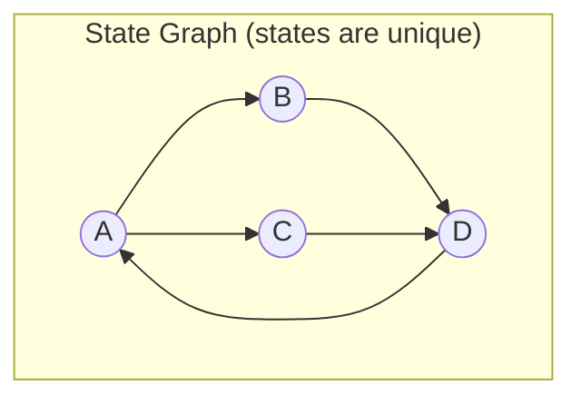

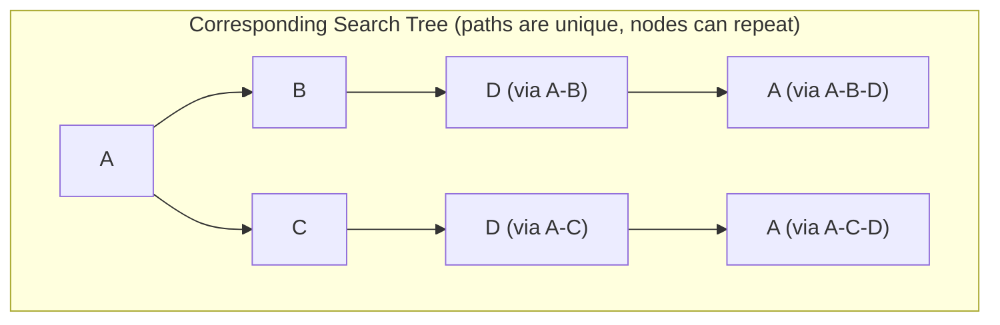

Notice state `D` appears once in the state graph but twice in the search tree (once per path that reaches it), and state `A` — the start — can even reappear as a *descendant* of itself if cycles aren't checked. This is exactly why graph-search's "explored set" matters for efficiency and for termination guarantees.

A **node** in the search tree is a data structure containing more than just a state: typically `{state, parent-node, action-taken, path-cost g(n), depth}`. The **frontier** is the set of leaf nodes available for expansion at any point in time.

### 1.6 State Representation

How you *represent* a state has a huge effect on how easy the problem is to formulate, how large the branching factor is, and how effective heuristics can be. Common representation styles:

1. **Atomic representation**: a state is a single indivisible "black box" label (e.g., city names in the route-finding problem — "Arad", "Bucharest"). Used by classical uninformed/informed search. Simple but can't express structure inside a state.

2. **Factored representation**: a state is a set of attribute/variable–value pairs, e.g. `{position: (3,2), fuel: 5, hasKey: true}`. Enables reasoning about *parts* of the state and underlies Constraint Satisfaction Problems (CSPs) and most planning systems.

3. **Structured representation**: a state (and the relationships between its objects) is expressed using logic/relations — e.g., `On(A,B) ∧ On(B,Table) ∧ Clear(A)` for a blocks-world state. Needed for first-order logic planning and relational domains.

Practical representation choices for our examples:
- 8-puzzle → a 3×3 array (or length-9 vector) holding tile positions.
- Water jug → an ordered pair (litres in jug A, litres in jug B).
- 8-queens → a length-8 array where index = column, value = row of the queen in that column (guarantees one queen per column by construction, shrinking the state space enormously).
- Chess → board configuration + whose turn + castling rights + en passant status (because path cost/history matters for legality — this is technically more than "just" the piece positions).

A good representation is **minimal but sufficient**: it should include everything needed to determine legal actions and to check the goal, but nothing redundant (redundant information blows up the state space and slows search without adding value).

---

## 2. Blind / Uninformed Search

**Uninformed (blind) search** algorithms have access to nothing but the problem definition — they cannot tell, while looking at a state, whether it is "closer" to the goal than another state. They can only distinguish goal states from non-goal states. Despite this handicap, they are the essential baseline and are still used whenever no good heuristic is available.

### 2.1 Node Expanding vs. Node Exploring

These two terms are often used loosely, but precisely:

- **Generating** a node: creating a child-node data structure for a state reachable via one action from a parent, and placing it on the frontier (it is now "known about" but not yet processed).
- **Expanding** a node: taking a node off the frontier, applying `ACTIONS(state)` to find *all* of its successors, and generating each of them (adding them to the frontier). "Expanding" = "generate all of my children."
- **Exploring** a node / adding to the **explored set** (or *closed list*): once a node has been expanded, it is moved to the `explored` set so it is never expanded again (in graph-search), preventing infinite loops and redundant work on repeated states.

So the life-cycle of a state in graph-search is: *generated* (created, sitting in frontier) → *expanded* (removed from frontier, its own children generated, itself placed in `explored`) → *(possibly re-discovered but ignored since it's already in explored)*.

### 2.2 Types of Uninformed Search — One by One

#### (a) Breadth-First Search (BFS)

Expands the *shallowest* unexpanded node first — implemented with a **FIFO queue** as the frontier. All nodes at depth $d$ are expanded before any node at depth $d+1$.

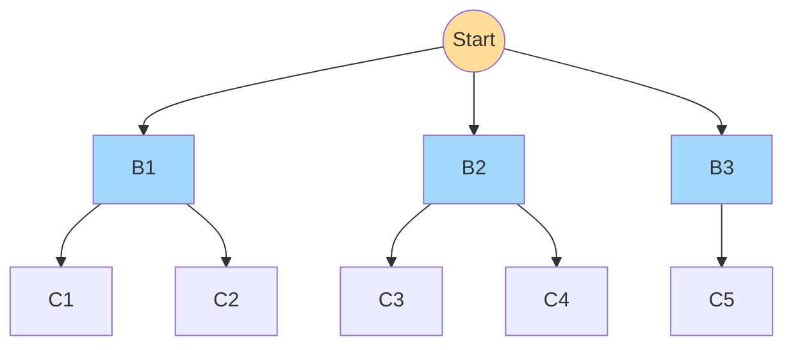
*BFS explores layer by layer — all orange/blue-level-1 nodes are expanded before any level-2 node.*

- **Complete**: Yes (if branching factor $b$ is finite).
- **Optimal**: Yes, *if* all step costs are equal (otherwise it finds the shallowest solution, not necessarily cheapest — Uniform-Cost Search generalizes BFS to handle unequal costs correctly by always expanding the lowest-$g(n)$ node using a priority queue).
- **Time complexity**: $O(b^d)$ where $b$ = branching factor, $d$ = depth of the shallowest goal.
- **Space complexity**: $O(b^d)$ — BFS must keep the *entire* frontier (which is exponential) in memory. This is BFS's biggest practical weakness — memory runs out long before time does.

#### (b) Depth-First Search (DFS)

Expands the *deepest* unexpanded node first — implemented with a **LIFO stack** (or recursion). It dives down one branch fully before backtracking.

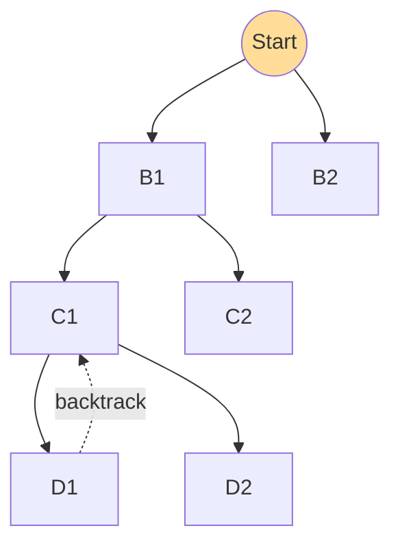

- **Complete**: No, in general (can loop forever down an infinite or cyclic branch). Complete on finite state spaces if repeated states are checked.
- **Optimal**: No — it may find *a* solution deep in one branch while a shorter one exists elsewhere.
- **Time complexity**: $O(b^m)$ where $m$ = maximum depth of the search tree (can be much worse than BFS if $m \gg d$).
- **Space complexity**: $O(bm)$ — only linear! DFS only needs to remember the single path from the root to the current node plus the unexpanded siblings along that path. This is DFS's big practical advantage over BFS.
- **Variant — Depth-Limited Search (DLS)**: DFS with a preset depth cutoff $\ell$; avoids infinite paths but is incomplete if $\ell < d$. Time $O(b^\ell)$, Space $O(b\ell)$.

#### (c) Iterative Deepening Search (IDS / IDDFS)

Runs Depth-Limited Search repeatedly with increasing limits $\ell = 0, 1, 2, \dots$ until a solution is found. It sounds wasteful (re-doing all the shallow work every iteration) but it isn't — because in a tree with branching factor $b$, the *vast majority of nodes are near the bottom level*, so the wasted re-generation of upper levels is a small fraction of the total work.

```
function ITERATIVE-DEEPENING-SEARCH(problem):
    for depth = 0 to ∞:
        result ← DEPTH-LIMITED-SEARCH(problem, depth)
        if result ≠ cutoff: return result
```

- **Complete**: Yes (if $b$ is finite).
- **Optimal**: Yes, if step costs are identical (like BFS).
- **Time complexity**: $O(b^d)$ — asymptotically the same order as BFS! Concretely, for $b=10, d=5$: BFS expands $1{+}10{+}100{+}\dots{+}100{,}000 = 111{,}111$ nodes, while IDS expands about $123{,}456$ nodes — only ~11% more. In general the ratio of IDS to BFS work is about $\frac{b}{b-1}$.
- **Space complexity**: $O(bd)$ — same tiny footprint as DFS! This combination — BFS-like completeness/optimality with DFS-like memory — is exactly why IDS is considered the **default uninformed search strategy when the search space is large and the depth of the solution is unknown**.

#### (d) Uniform-Cost Search (UCS) — mentioned for completeness

Instead of expanding by depth, UCS always expands the frontier node with the lowest **path cost $g(n)$ so far** (frontier = priority queue ordered by $g$). It generalizes BFS correctly to weighted graphs.
- Complete: Yes (if step costs ≥ some $\epsilon > 0$). Optimal: Yes. Time/Space: roughly $O(b^{1+\lfloor C^*/\epsilon\rfloor})$ where $C^*$ is the optimal cost — can be much worse than $b^d$ if there are many small steps.

#### (e) Bidirectional Search

Runs **two simultaneous searches** — one forward from the start, one backward from the goal — and stops as soon as the two frontiers meet. Backward search requires being able to compute predecessors (invertible actions), and if there are multiple goal states, all of them must seed the backward frontier.

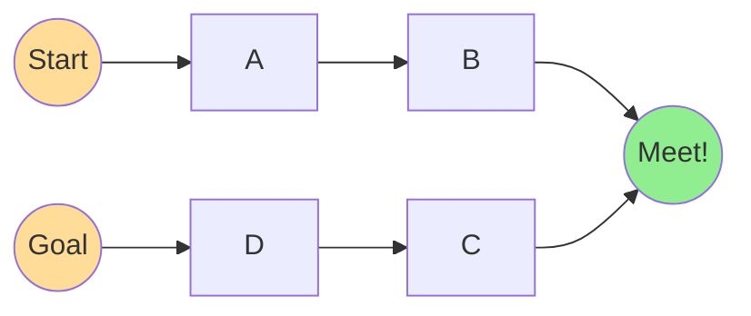

- **Why it's powerful**: if both searches use BFS and the branching factor is $b$ with a solution at depth $d$, each half only needs to search to depth $d/2$. Since $O(b^{d/2}) + O(b^{d/2}) \ll O(b^d)$, this is an *exponential* saving. Example: $b=10, d=6$ — plain BFS expands ~1,111,111 nodes; bidirectional search expands only ~2,222.
- **Complete & Optimal**: Yes, under the same conditions as BFS (assuming both directions use BFS/UCS-like strategies).
- **Practical difficulties**: how to search "backward" from a goal when actions aren't easily reversible; handling multiple goal states; efficiently testing whether the two frontiers have met (usually via a hash set).

### 2.3 Comparison Table — Uninformed Search Strategies

| Criterion | BFS | Uniform-Cost | DFS | Depth-Limited (limit ℓ) | IDS | Bidirectional (if applicable) |
|---|---|---|---|---|---|---|
| **Complete?** | Yes$^a$ | Yes$^{a,b}$ | No | No (Yes if ℓ ≥ d) | Yes$^a$ | Yes$^a$ |
| **Optimal?** | Yes$^c$ | Yes | No | No | Yes$^c$ | Yes$^c$ |
| **Time** | $O(b^d)$ | $O(b^{1+\lfloor C^*/\epsilon \rfloor})$ | $O(b^m)$ | $O(b^\ell)$ | $O(b^d)$ | $O(b^{d/2})$ |
| **Space** | $O(b^d)$ | $O(b^{1+\lfloor C^*/\epsilon \rfloor})$ | $O(bm)$ | $O(b\ell)$ | $O(bd)$ | $O(b^{d/2})$ |

*a: complete if $b$ is finite. b: complete if step cost ≥ ε > 0. c: optimal if step costs are identical/non-decreasing with depth. Here $b$ = branching factor, $d$ = depth of shallowest solution, $m$ = maximum depth of the tree (possibly ∞), $\ell$ = depth limit, $C^*$ = cost of optimal solution.*

**Take-away intuition**: BFS/UCS trade memory for guarantees; DFS trades guarantees for memory; IDS gets (almost) the best of both worlds by repeating cheap shallow work; Bidirectional search gets an exponential win whenever backward expansion is feasible.

---

## 3. Heuristics and Informed Search

### 3.1 What Is a Heuristic?

A **heuristic function** $h(n)$ estimates the cost of the cheapest path from node $n$ to a goal, *without* actually searching that far — it's an informed "guess" built from domain knowledge. $h(n) = 0$ for every goal node by definition. Good heuristics are the difference between search that's tractable and search that's an exponential-time crawl.

Examples:
- 8-puzzle: $h_1$ = number of misplaced tiles; $h_2$ = sum of Manhattan (grid) distances of tiles from their goal positions.
- Route-finding: $h$ = straight-line ("as the crow flies") distance to the goal city.
- 8-queens: number of pairs of queens currently attacking each other.

### 3.2 Greedy Best-First Search

Expands the node that *appears* closest to the goal, using only the heuristic: $f(n) = h(n)$.

- Fast in practice (tends to beeline toward the goal) but **not complete** (can get stuck in loops/dead ends on infinite spaces) and **not optimal** (following the heuristic can lead you down an expensive path while ignoring how much you already spent to get there — it ignores $g(n)$ completely). Time and space are $O(b^m)$ worst case, but with a good heuristic can be dramatically better in practice.

### 3.3 A* Search

A* fixes greedy search's flaw by combining *both* pieces of information:

$$f(n) = g(n) + h(n)$$

where $g(n)$ = actual cost from start to $n$ (known, exact), and $h(n)$ = estimated cost from $n$ to the nearest goal (a guess). A* always expands the frontier node with the **lowest $f(n)$**. Intuitively: "I want the path that is cheapest *overall*, counting both what I've already spent and what I still expect to spend."

You can view A* as sitting exactly between two other algorithms:
- **Uniform-Cost Search** = A* with $h(n) = 0$ everywhere (only cares about the past).
- **Greedy Best-First Search** = A* with $g(n)$ ignored (only cares about the future estimate).
- A* = both, properly balanced.

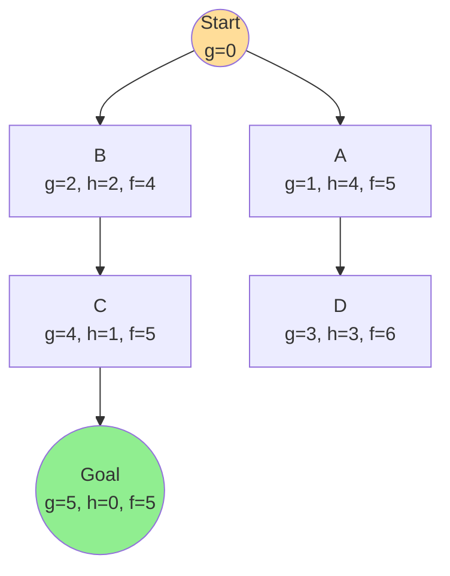
*A* would expand B next (lowest f=4), then C (f=5, tied with A but let's say expanded), then Goal — never wasting effort on D's more expensive branch.*

**Properties of admissible-heuristic A***:
- **Complete**: Yes (on locally finite graphs with positive step costs).
- **Optimal**: Yes, provided $h(n)$ is *admissible* (tree-search) or *consistent* (graph-search) — see below.
- **Optimally efficient**: among all algorithms that use the same heuristic information and that never expand a node whose $f > C^*$, no algorithm is guaranteed to expand fewer nodes than A* (Dechter & Pearl's result — this holds precisely when the heuristic is *consistent*).
- **Time/Space**: still exponential in the worst case (and, notoriously, A* keeps *all* generated nodes in memory, which is often the limiting factor in practice — motivating memory-bounded variants like **IDA\*** (Iterative-Deepening A*, which reruns depth-first search but bounds by $f$-cost instead of depth, giving A*-like optimality with only linear space) and **SMA\*** (Simplified Memory-bounded A*).

### 3.4 Proof of Optimality of A\*

There are two versions of the proof, depending on whether you use **Tree-Search** (no repeated-state checking) or **Graph-Search** (with an explored set) — the required heuristic property is stronger in the second case.

**(a) Optimality with Tree-Search, requiring only admissibility**

*Definition — Admissible heuristic*: $h(n) \le h^*(n)$ for every node $n$, where $h^*(n)$ is the *true* optimal cost from $n$ to the goal. In words: **an admissible heuristic never overestimates** — it is always optimistic.

*Claim*: If $h(n)$ is admissible, A* using Tree-Search returns an optimal solution.

*Proof (by contradiction)*: Suppose a suboptimal goal $G_2$ has been generated and sits in the frontier, and there exists an optimal goal $G$ with true cost $C^*$. Let $n$ be any *unexpanded* node on the frontier that lies on a shortest path to $G$ (such a node must exist, because the path to $G$ starts at the root and its later nodes haven't been expanded yet).

1. Because $h(G_2) = 0$ (all goal-node heuristics are 0): $f(G_2) = g(G_2)$.
2. Because $G_2$ is suboptimal: $g(G_2) > C^* = g(G)$.
3. Because $h(G)=0$: $f(G) = g(G) = C^*$.
4. Combining (1)-(3): $f(G_2) > f(G)$.
5. Because $h(n)$ is admissible, $h(n) \le h^*(n)$, i.e., the estimate at $n$ never exceeds the true remaining cost, so $f(n) = g(n)+h(n) \le g(n) + h^*(n) = C^*$ (since $n$ is *on* an optimal path, $g(n)+h^*(n)=C^*$ exactly). Hence $f(n) \le C^* = f(G) < f(G_2)$.

So $f(n) \le f(G) < f(G_2)$ — meaning A* (which always expands the lowest-$f$ frontier node) will *always* prefer $n$ (or some other node on the optimal path) over $G_2$, and therefore can never select the suboptimal goal $G_2$ for expansion until every node on the true optimal path (including $G$ itself) has already been expanded first. Hence the first goal state A* pulls off the frontier is guaranteed optimal. $\blacksquare$

**(b) Optimality with Graph-Search, requiring consistency**

Tree-search's proof breaks down for graph-search, because graph-search may throw away a newly generated node just because its state is already `explored` — and if the *first* time we reached that state wasn't via the cheapest path, we'd be stuck with a suboptimal $g$-value forever. To fix this we need a stronger property:

*Definition — Consistent (monotonic) heuristic*: for every node $n$ and every successor $n'$ generated by action $a$ with step cost $c(n,n')$:
$$h(n) \le c(n,n') + h(n')$$
This is just the triangle inequality applied to estimated distances. (Every consistent heuristic is automatically admissible, but not vice-versa.)

*Lemma*: If $h$ is consistent, then $f(n)$ is non-decreasing along any path from the root.

*Proof*: Let $n'$ be a child of $n$ generated via action with cost $c(n,n')$. Then
$$f(n') = g(n') + h(n') = \big(g(n) + c(n,n')\big) + h(n') \ge g(n) + h(n) = f(n)$$
where the inequality follows directly from the consistency condition $h(n) \le c(n,n')+h(n')$. So $f$ never decreases as you go deeper — A* effectively performs Dijkstra-like non-decreasing-cost expansion.

*Consequence*: Because A* always expands nodes in non-decreasing order of $f$, and $f$ equals the *true* cost $g$ exactly at goal nodes (since $h=0$ there), the **first time any node is popped off the frontier for expansion, the optimal cost to reach it has already been found** — so it is safe to add it to `explored` and never revisit it. In particular, the first goal node expanded is optimal. $\blacksquare$

This is also exactly why, with a consistent heuristic, "A* graph-search" behaves just like running Dijkstra's algorithm on the edge-reweighted graph where new weight $= c(n,n') + h(n') - h(n) \ge 0$.

### 3.5 Choice of Heuristics; Admissible Heuristics

Not all admissible heuristics are equally *useful* — admissibility only guarantees correctness, not speed. What we additionally want is a heuristic that is as close to $h^*$ as possible while still never overestimating; this is captured by the notion of **dominance**:

> If $h_2(n) \ge h_1(n)$ for all $n$ (and both are admissible), we say $h_2$ **dominates** $h_1$. A* using $h_2$ will never expand more nodes than A* using $h_1$ (dominance directly implies fewer or equal expansions, because a bigger admissible $h$ prunes the search more aggressively while remaining safe).

**Classic 8-puzzle example**:
- $h_1(n)$ = number of misplaced tiles (admissible: each misplaced tile needs at least 1 move to fix).
- $h_2(n)$ = sum of Manhattan distances of each tile from its goal position (admissible: each tile needs at least that many single-step moves, ignoring the fact that other tiles block the way).
- Since every misplaced tile is at least 1 Manhattan-step away, $h_2(n) \ge h_1(n)$ always → $h_2$ dominates $h_1$ → A* with $h_2$ explores far fewer nodes.

**How to construct admissible heuristics systematically**:
1. **Relaxed problems**: remove some constraint from the original problem (e.g., "a tile can move to any empty square, not just an adjacent one" → gives $h_1$; "a tile can move to the adjacent square even if occupied" → gives $h_2$). The optimal solution cost of a relaxed problem is always ≤ the cost of the real problem, so it's automatically admissible. This is the single most productive technique in practice.
2. **Pattern databases**: precompute exact solution costs for a sub-problem (e.g., only tiles 1,2,3,4 of the 8-puzzle) and store them in a lookup table; use the retrieved value as $h$ for the full problem.
3. **Combining multiple admissible heuristics**: if $h_1, \dots, h_k$ are all admissible, then $h(n) = \max(h_1(n),\dots,h_k(n))$ is also admissible and dominates each individual one — "take whichever pessimistic-but-safe estimate is largest."
4. **Learning heuristics**: use machine learning on many solved instances to fit a function that predicts solution cost (not guaranteed admissible unless specifically constrained, but often effective in practice for satisficing search).

The general trade-off: computing a very accurate $h(n)$ (e.g., by actually solving a large relaxed problem) reduces the *number of nodes expanded* but increases the *time to compute $h$ per node* — the best heuristic minimizes **total** search time, which is a balance, not simply "bigger is always better."

---

# PART II — NEURAL NETWORKS

## 4. Definition and Properties of Neural Networks

An **(artificial) neural network (ANN)** is a computational model loosely inspired by biological brains: a large number of simple processing units (**neurons**), each performing a small computation, connected together by weighted links, whose *collective, parallel* behaviour can approximate very complex functions. Formally, a neural network is a parameterised function $f_\theta: \mathbb{R}^n \to \mathbb{R}^m$ built by composing layers of simple non-linear transformations, where $\theta$ (the weights and biases) is learned from data rather than hand-programmed.

**Key properties that make ANNs useful:**

- **Universal function approximation**: A feedforward network with even a single hidden layer of finite width can approximate any continuous function on a compact domain to arbitrary accuracy, given enough hidden units (the *Universal Approximation Theorem*). This is why NNs are so flexible across domains.
- **Learning from data**: weights are not hand-designed; they're adjusted automatically (typically via gradient descent + backpropagation) to minimize error on example data.
- **Distributed, parallel representation**: knowledge is spread across many weighted connections rather than stored in one explicit rule, giving graceful degradation (damage to a few units/weights doesn't destroy the whole function) and natural parallel-hardware speedups (GPUs).
- **Non-linearity**: stacking linear operations alone can only ever represent linear functions (a composition of linear maps is still linear) — the non-linear **activation function** inserted between layers is what gives networks the ability to represent curved/complex decision boundaries.
- **Adaptivity / generalization**: a well-trained network doesn't just memorize training examples — ideally it captures the underlying pattern and performs well on unseen data (this connects directly to the bias–variance discussion in §8).
- **Fault tolerance & noise robustness**: because information is distributed across many weights, NNs tend to degrade gracefully with noisy input or minor internal damage, rather than failing catastrophically.

## 5. Elements of a Simple Neuron

The computational unit at the heart of every neural network — whether you call it a "perceptron," "McCulloch-Pitts neuron," or "unit" — has the same basic anatomy:

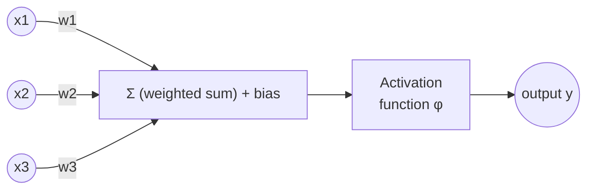

1. **Inputs** $x_1, x_2, \dots, x_n$ — the signals coming from either the raw data or the previous layer's neurons.
2. **Weights** $w_1, w_2, \dots, w_n$ — one per input connection, representing the *strength/importance* of that input to this neuron. Learning = adjusting these.
3. **Bias** $b$ — an extra learnable constant added to the weighted sum, letting the neuron shift its activation threshold independent of the inputs (equivalent to an input that is always 1, with its own weight).
4. **Net input / pre-activation** — the weighted sum: $z = \sum_{i=1}^n w_i x_i + b = \mathbf{w}^\top\mathbf{x} + b$.
5. **Activation function** $\varphi$ — a (usually non-linear) function applied to $z$ to produce the neuron's output: $y = \varphi(z)$. This is what allows the network as a whole to model non-linear relationships (see §6).
6. **Output** $y$ — passed on as an input to the next layer's neurons (or, if this is an output-layer neuron, treated as the network's final prediction).

A single neuron with a step activation is exactly the classic **perceptron**, which computes a linear decision boundary and can only solve *linearly separable* problems (famously, it cannot compute XOR) — this limitation is precisely what motivated stacking neurons into **multi-layer** networks.

## 6. Activation Functions

Activation functions inject non-linearity and shape how strongly/quickly a neuron "fires." Choice of activation affects training dynamics (especially the vanishing/exploding gradient problem), output range, and computational cost.

| Function | Formula | Range | Notes |
|---|---|---|---|
| **Step (threshold)** | $1$ if $z\ge 0$ else $0$ | {0,1} | Original perceptron; not differentiable, so unusable with gradient-based learning. |
| **Sigmoid (logistic)** | $\sigma(z) = \frac{1}{1+e^{-z}}$ | (0,1) | Smooth, interpretable as a probability; saturates for large $\lvert z\rvert$ → vanishing gradients in deep nets. |
| **Tanh** | $\tanh(z) = \frac{e^z-e^{-z}}{e^z+e^{-z}}$ | (−1,1) | Zero-centred version of sigmoid (helps optimisation), still saturates. |
| **ReLU** (Rectified Linear Unit) | $\max(0,z)$ | [0,∞) | Cheap, doesn't saturate for $z>0$, default choice in most modern deep nets; can suffer "dying ReLU" (neuron stuck outputting 0 forever if it drifts into $z<0$ region). |
| **Leaky ReLU** | $z$ if $z>0$ else $\alpha z$ (small $\alpha$) | (−∞,∞) | Fixes dying ReLU by allowing a small gradient when $z<0$. |
| **Softmax** | $\frac{e^{z_i}}{\sum_j e^{z_j}}$ | (0,1), sums to 1 | Used on the *output layer* for multi-class classification — converts a vector of scores into a probability distribution. |

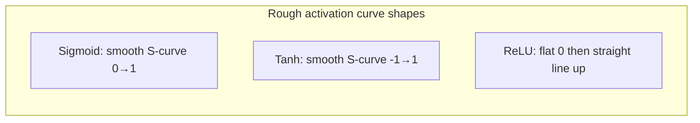

**Why non-linearity is essential**: if every layer only computed $\mathbf{W}_2(\mathbf{W}_1\mathbf{x})$ with no activation in between, that whole stack collapses algebraically into a single matrix multiplication $\mathbf{W}\mathbf{x}$ — i.e., no matter how many layers you stack, the network could only ever represent a *linear* function. The non-linear activation between layers is precisely what allows arbitrarily deep stacks to represent arbitrarily complex, curved decision boundaries — it's the entire reason "deep" learning works better than a single linear layer.

## 7. Classification of Neural Networks

Neural networks are commonly classified along a few dimensions:

**(a) By connectivity / information flow**
- **Feedforward Neural Networks (FFN)**: information flows in one direction only, input → hidden layers → output, with no cycles/loops (§7.1).
- **Recurrent Neural Networks (RNN)**: connections can loop back, so a neuron's output can (indirectly) feed back into itself over time — gives the network *memory* of previous inputs (§9.2).

**(b) By architecture / specialization**
- **Multi-Layer Perceptron (MLP)** — fully-connected feedforward network, the "vanilla" deep net.
- **Convolutional Neural Network (CNN)** — specialised feedforward architecture using local, weight-shared filters, dominant for image/grid-like data (§9.1).
- **Recurrent variants (RNN, LSTM, GRU)** — specialised for sequential/time-series data (§9.2–9.4).
- **Autoencoders** — feedforward networks trained to reconstruct their own input through a compressed ("bottleneck") representation, used for dimensionality reduction/denoising.
- **Generative Adversarial Networks (GANs), Transformers**, etc. — more advanced architectures built from the same underlying neuron/activation/backprop building blocks.

**(c) By learning paradigm** — supervised, unsupervised, or reinforcement (this is actually a property of *how the network is trained*, not the architecture itself — see Part III, §10).

**(d) By layer depth** — "shallow" networks (1 hidden layer) vs. "deep" networks (many hidden layers) — deep learning specifically refers to networks with many stacked layers, which can represent hierarchical features (e.g., edges → shapes → objects in vision).

### 7.1 Feed-Forward Network

A **Feed-Forward Neural Network** is the most fundamental NN architecture: neurons are arranged into an **input layer**, one or more **hidden layers**, and an **output layer**, with connections running strictly forward (no cycles, no connections back to earlier layers or within the same layer in the simplest case).

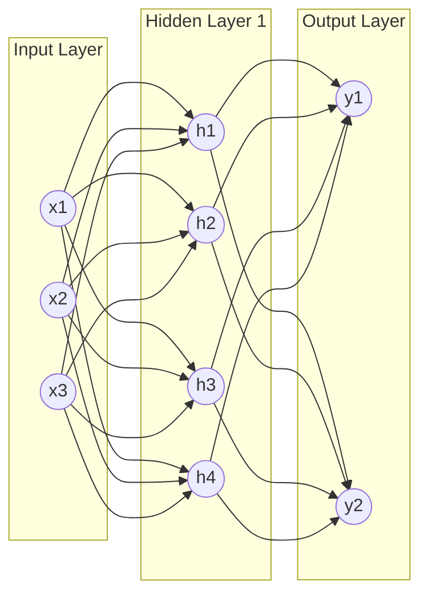

**Forward pass, layer by layer**: for layer $l$,
$$\mathbf{z}^{(l)} = \mathbf{W}^{(l)}\mathbf{a}^{(l-1)} + \mathbf{b}^{(l)}, \qquad \mathbf{a}^{(l)} = \varphi\big(\mathbf{z}^{(l)}\big)$$
starting from $\mathbf{a}^{(0)} = \mathbf{x}$ (the raw input) and ending at $\mathbf{a}^{(L)}$, the network's prediction. Each layer's weight matrix $\mathbf{W}^{(l)}$ holds one row per neuron in layer $l$, one column per neuron in layer $l{-}1$.

Because information only flows forward, computing the output for a given input is simple and fast — the entire difficulty in feedforward networks lies in *training* them, i.e., finding good values for every $\mathbf{W}^{(l)}, \mathbf{b}^{(l)}$, which is where backpropagation and gradient descent come in.

### 7.2 Back-Propagation Network / Algorithm

"Back-propagation" refers both to a *type* of network (any feedforward network trained via the backprop algorithm) and, more commonly, to the **training algorithm itself** — the method by which the gradient of the loss function with respect to *every* weight in the network is computed efficiently, so that gradient descent (§7.3) can update them.

**The core problem**: for the output layer, we know the target $y$ and the prediction $\hat y$, so we can directly compute how the error changes with respect to the *output layer's* weights. But for a *hidden*-layer neuron, there is no explicit "target" — we only know it contributed *somehow* to the final error, through however many downstream neurons its output feeds into. Naively computing the gradient for every weight independently, is prohibitively expensive for large networks (roughly $O(\text{weights}^2)$ operations, since one has to differentiate through the whole graph independently for every weight).

**The insight — the chain rule of calculus, applied backward**: if a loss $L$ depends on $L$ depends on an intermediate variable $y$ which in turn depends on $x$, then $\frac{\partial L}{\partial x} = \frac{\partial L}{\partial y}\cdot\frac{\partial y}{\partial x}$. In a network, we can compute the loss's sensitivity to the *last* layer's outputs first (easy, since we have the target), and then propagate that sensitivity backward, layer by layer, re-using the previous layer's already-computed sensitivity — turning an expensive independent-derivative computation into one single backward pass that costs about the same as one forward pass.

**Algorithm outline** (for a network with $L$ layers, loss $\mathcal{L}$, e.g. mean-squared error or cross-entropy):

1. **Forward pass**: compute and cache every $\mathbf{z}^{(l)}$ and $\mathbf{a}^{(l)}$ for $l = 1,\dots,L$, ending in prediction $\hat{\mathbf y}=\mathbf a^{(L)}$.
2. **Output error**: compute the "error signal" at the last layer,
$$\boldsymbol{\delta}^{(L)} = \nabla_{\mathbf a^{(L)}}\mathcal{L} \odot \varphi'\big(\mathbf z^{(L)}\big)$$
(elementwise product $\odot$ of the loss gradient w.r.t. the output, and the derivative of the activation function).
3. **Backward pass** — propagate the error signal to earlier layers, for $l = L-1, \dots, 1$:
$$\boldsymbol{\delta}^{(l)} = \Big(\big(\mathbf{W}^{(l+1)}\big)^{\!\top}\boldsymbol{\delta}^{(l+1)}\Big)\odot \varphi'\big(\mathbf z^{(l)}\big)$$
i.e., "take the error from the layer downstream, route it backward through the same weights it came forward through, and scale by how sensitive *this* layer's own activation is."
4. **Gradient extraction**: once every $\boldsymbol{\delta}^{(l)}$ is known, the gradient with respect to each layer's parameters is simply
$$\frac{\partial \mathcal{L}}{\partial \mathbf{W}^{(l)}} = \boldsymbol{\delta}^{(l)}\big(\mathbf a^{(l-1)}\big)^{\!\top}, \qquad \frac{\partial \mathcal{L}}{\partial \mathbf b^{(l)}} = \boldsymbol{\delta}^{(l)}$$
5. **Update**: feed these gradients into a gradient-descent update rule (§7.3).

The name "back-propagation" literally describes step 3: the "error" is propagated *backward* through the network, from the last layer to the first, one layer at a time, with each layer reusing work already done by the layer after it — this reuse is what makes the whole computation as cheap as a single forward pass, instead of scaling quadratically with the number of weights.

### 7.3 Gradient Descent Algorithm

**Gradient descent** is the general-purpose optimisation algorithm used to actually *update* the weights once backprop has supplied the gradients. The intuition: the gradient $\nabla_\theta\mathcal{L}$ points in the direction of *steepest increase* of the loss; so moving a small step in the *opposite* direction (steepest decrease) should reduce the loss.

**Update rule**:
$$\theta \leftarrow \theta - \eta\,\nabla_\theta \mathcal{L}(\theta)$$
where $\eta$ (the **learning rate**) controls the step size. Too large → the optimizer overshoots/diverges/oscillates; too small → training crawls and can get stuck in flat regions or takes prohibitively long.

**Variants, depending on how much data is used per gradient estimate**:

| Variant | Data used per update | Pros | Cons |
|---|---|---|---|
| **Batch (full-batch) GD** | Entire training set | Stable, accurate gradient direction | Very slow / memory-heavy per step for large datasets |
| **Stochastic GD (SGD)** | 1 random example | Fast updates, escapes shallow local minima due to noise | Noisy, unstable convergence path |
| **Mini-batch GD** | A small batch (e.g. 32–256 examples) | Good trade-off: reasonably stable *and* fast; exploits vectorized/GPU computation | Needs batch-size tuning |

**Common refinements** built on top of plain gradient descent:
- **Momentum**: accumulate a moving average of past gradients so updates keep moving in a consistent direction, smoothing out oscillations and speeding convergence through ravines.
- **Adaptive learning-rate methods** (AdaGrad, RMSProp, **Adam** — the most widely used in practice): automatically scale the learning rate per-parameter based on the history of gradients for that parameter, which helps enormously with parameters that need very different step sizes.

**Geometric picture**: think of $\mathcal{L}(\theta)$ as a landscape (a "loss surface") over the space of all possible weight settings. Training is literally "rolling downhill" on that surface, using local slope information at each step, hoping to settle in a low valley (ideally the global minimum, but in practice a good-enough local minimum/saddle region is usually fine for deep networks in practice, since deep loss landscapes tend to have many nearly-equally-good minima).

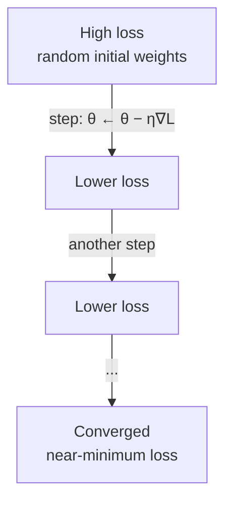

---

## 8. Specialized Neural Architectures — CNN, RNN, LSTM, GRU

### 8.1 Convolutional Neural Networks (CNN)

CNNs are feedforward networks specialised for data with strong **local, grid-like structure** — most famously images, but also audio spectrograms, time-series, etc. Instead of connecting every input pixel to every neuron (as a fully-connected MLP would — extremely parameter-heavy and ignorant of spatial structure), CNNs use small, weight-shared **filters (kernels)** that slide across the input.

**Core components**:
- **Convolutional layer**: a small filter (e.g. 3×3) slides across the input, computing a dot product at each position, producing a **feature map**. Because the *same* filter weights are reused at every position (**weight sharing**), the network learns to detect a pattern (e.g. an edge) regardless of *where* it appears in the image — and uses far fewer parameters than a fully-connected layer would.
- **Activation** (typically ReLU) applied to each feature map, same as any other layer.
- **Pooling layer** (e.g. max-pooling): down-samples feature maps (e.g., taking the max value in each 2×2 block), reducing spatial size, computation, and providing a degree of translation invariance.
- **Stacking**: early convolutional layers detect low-level features (edges, colors, textures); deeper layers combine these into higher-level features (shapes, object parts, whole objects) — this hierarchical feature learning is CNNs' great strength.
- **Fully-connected layer(s)** at the end, turning the final feature maps into class scores/predictions.

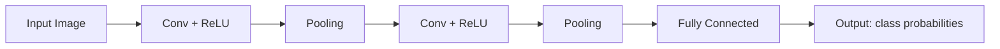

CNNs are trained with exactly the same backpropagation + gradient descent machinery as any feedforward network — the only difference is the *architecture* (weight sharing, local connectivity) that's differentiated through.

### 8.2 Recurrent Neural Networks (RNN)

RNNs are designed for **sequential data** (text, speech, time series) where the order and context of earlier elements matters for interpreting later ones. Unlike a feedforward network, an RNN maintains a **hidden state** $h_t$ that is updated at every time step and fed back in as an additional input to the *next* time step — giving the network a form of memory.

$$h_t = \varphi\big(W_{hh}h_{t-1} + W_{xh}x_t + b_h\big), \qquad y_t = W_{hy}h_t + b_y$$

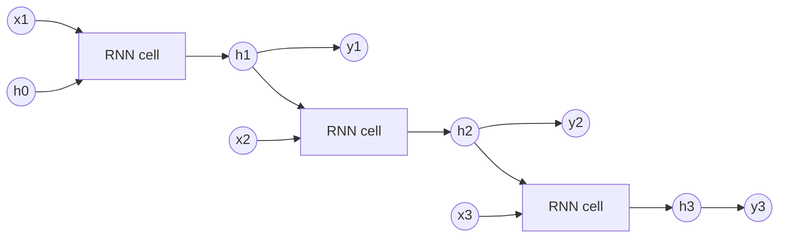

**The core weakness — vanishing/exploding gradients**: to train an RNN, backpropagation is applied "through time" (unrolling the recurrence into an equivalent deep feedforward network with one layer per time step, then applying standard backprop) — this is called **Backpropagation Through Time (BPTT)**. Because the *same* weight matrix is multiplied repeatedly across many time steps, gradients either shrink toward zero (**vanishing**, if the repeated factor has magnitude < 1) or blow up (**exploding**, if magnitude > 1) exponentially with sequence length. Vanishing gradients in particular mean plain RNNs struggle to learn dependencies spanning many time steps — the network effectively "forgets" information from far in the past. This is precisely the motivation for LSTM and GRU.

### 8.3 Long Short-Term Memory (LSTM)

LSTM introduces a separate **cell state** $c_t$ (a kind of conveyor belt of memory that flows mostly *unchanged* across time steps, only modified by carefully controlled additions/removals) alongside the usual hidden state, plus three **gates** — small neural sub-networks (each a sigmoid layer producing values between 0 and 1, interpreted as "how much to let through") that regulate what enters, leaves, and is exposed from that memory:

- **Forget gate** $f_t = \sigma(W_f[h_{t-1}, x_t] + b_f)$ — decides how much of the old cell state $c_{t-1}$ to keep ($f_t \approx 1$: keep almost all; $f_t\approx 0$: discard).
- **Input gate** $i_t = \sigma(W_i[h_{t-1}, x_t] + b_i)$ — decides how much of the new candidate information to add.
- **Candidate cell content** $\tilde c_t = \tanh(W_c[h_{t-1}, x_t] + b_c)$ — the new information proposed for the cell state.
- **Cell state update**: $c_t = f_t \odot c_{t-1} + i_t \odot \tilde c_t$ (elementwise: partially forget the old, partially add the new).
- **Output gate** $o_t = \sigma(W_o[h_{t-1}, x_t] + b_o)$ — decides how much of the (squashed) cell state to expose as the hidden output.
- **Hidden state**: $h_t = o_t \odot \tanh(c_t)$.

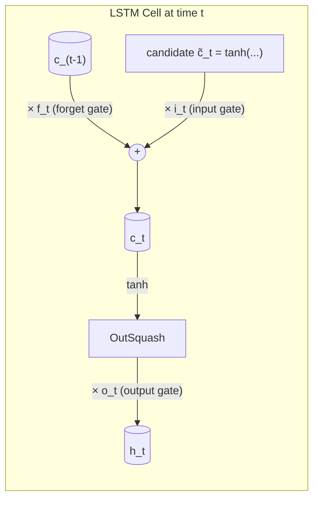

**Why this fixes vanishing gradients**: the cell-state update $c_t = f_t \odot c_{t-1} + i_t\odot\tilde c_t$ is *additive*, not purely multiplicative like a plain RNN's hidden-state update — so gradients can flow backward through the cell state across many time steps largely unchanged (as long as $f_t$ stays close to 1), allowing LSTMs to learn dependencies spanning hundreds of steps, which plain RNNs cannot.

### 8.4 Gated Recurrent Unit (GRU)

GRU (Cho et al., 2014) is a simplification of LSTM: it merges the cell state and hidden state into one, and reduces three gates down to two, with fewer parameters and typically faster training while achieving comparable performance on many tasks:

- **Update gate** $z_t = \sigma(W_z[h_{t-1},x_t]+b_z)$ — plays the combined role of LSTM's forget *and* input gates: how much of the old hidden state to keep vs. replace with new content.
- **Reset gate** $r_t = \sigma(W_r[h_{t-1},x_t]+b_r)$ — decides how much of the previous hidden state to "forget" when computing the new candidate (if $r_t\approx0$, the candidate is computed almost as if there were no previous state at all).
- **Candidate hidden state**: $\tilde h_t = \tanh\big(W_h[r_t\odot h_{t-1}, x_t]+b_h\big)$.
- **Final hidden state**: $h_t = (1-z_t)\odot h_{t-1} + z_t \odot \tilde h_t$.

**LSTM vs. GRU, at a glance**:

| | LSTM | GRU |
|---|---|---|
| Memory | separate cell state *and* hidden state | single hidden state only |
| Gates | 3 (forget, input, output) | 2 (update, reset) |
| Parameters | more | fewer (~25% less typically) |
| Training speed | slower | faster |
| Typical performance | slightly better on very long sequences / large datasets | competitive, often just as good, especially on smaller datasets |

---

# PART III — CORE MACHINE LEARNING CONCEPTS

## 9. Support Vector Machine (SVM)

An SVM is a supervised-learning algorithm for **classification** (and, with modification, regression) whose central idea is: among all the possible hyperplanes that separate two classes, choose the one that leaves the **widest possible margin** between the classes — because intuitively, the boundary that stays as far as possible from *both* classes is the one most likely to generalize well to new, unseen points near the boundary.

### 9.1 The Maximum-Margin Hyperplane

Given labelled training points $(\mathbf x_i, y_i)$ with $y_i \in \{-1,+1\}$, a hyperplane is defined by $\mathbf w^\top\mathbf x + b = 0$. The **margin** is the distance from the hyperplane to the nearest training point of either class, which turns out to equal $\frac{1}{\lVert\mathbf w\rVert}$ once the hyperplane is scaled so that the nearest points satisfy $y_i(\mathbf w^\top\mathbf x_i + b) = 1$. Maximizing the margin is therefore equivalent to *minimizing* $\lVert\mathbf w\rVert$ (or, more conveniently for calculus, $\tfrac12\lVert\mathbf w\rVert^2$), subject to every point being correctly classified with at least that margin:

$$\min_{\mathbf w, b} \tfrac12\lVert\mathbf w\rVert^2 \quad \text{s.t.} \quad y_i(\mathbf w^\top\mathbf x_i+b)\ge 1 \ \ \forall i$$

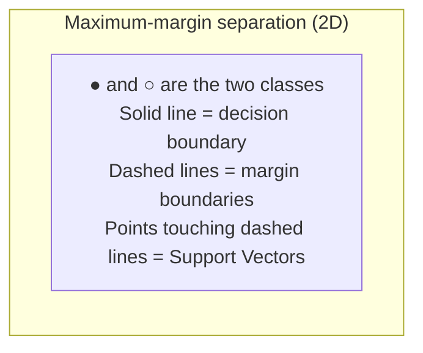

The points that lie exactly on the margin boundary (i.e., for which the constraint is tight, $y_i(\mathbf w^\top\mathbf x_i+b)=1$) are called the **support vectors** — and remarkably, *only these points* determine the position of the final hyperplane; moving or removing any non-support-vector point doesn't change the solution at all. This sparsity is one of SVM's most attractive theoretical properties.

### 9.2 Soft Margin (handling non-separable data)

Real data is rarely perfectly linearly separable, and even when it is, a hard-margin classifier is extremely sensitive to individual points near the boundary. The **soft-margin SVM** allows some points to violate the margin (or even be misclassified), penalized through **slack variables** $\xi_i \ge 0$ and a regularization hyperparameter $C$:

$$\min_{\mathbf w,b,\xi} \tfrac12\lVert\mathbf w\rVert^2 + C\sum_i \xi_i \quad \text{s.t.} \quad y_i(\mathbf w^\top \mathbf x_i + b) \ge 1-\xi_i,\ \ \xi_i\ge0$$

- **Large $C$**: heavily penalizes violations → narrower margin, fewer errors tolerated, more flexible/complex boundary (risk of overfitting).
- **Small $C$**: tolerates more violations → wider margin, simpler boundary (risk of underfitting).
This is exactly a bias–variance knob (§10), and is usually tuned by cross-validation.

### 9.3 The Kernel Trick

A straight hyperplane is a very rigid boundary — many real datasets need a curved boundary (e.g., one class forms a ring around the other). The **kernel trick** solves this without ever explicitly computing an expensive high-dimensional mapping: instead of working with raw feature vectors directly, SVM's optimisation only ever needs *dot products* between pairs of points, $\mathbf x_i^\top \mathbf x_j$. A **kernel function** $K(\mathbf x_i,\mathbf x_j)$ computes what the dot product *would be* after mapping both points into some (possibly infinite-dimensional) feature space $\phi(\cdot)$, i.e. $K(\mathbf x_i,\mathbf x_j)=\phi(\mathbf x_i)^\top\phi(\mathbf x_j)$, *without ever computing $\phi$ explicitly* — making it computationally feasible to fit a linear separator in an enormously higher-dimensional (even infinite-dimensional) space, which corresponds to a highly non-linear boundary back in the original space.

Common kernels: **linear** ($K=\mathbf x_i^\top\mathbf x_j$), **polynomial** ($K=(\mathbf x_i^\top\mathbf x_j + c)^d$), and **RBF/Gaussian** ($K = e^{-\gamma\lVert \mathbf x_i-\mathbf x_j\rVert^2}$, corresponding to an infinite-dimensional feature space and able to fit essentially arbitrary boundaries with enough tuning).

---

## 10. Supervised, Unsupervised, and Reinforcement Learning

These are the three broad **learning paradigms** — they describe what kind of feedback the learner receives, not any specific algorithm.

### 10.1 Supervised Learning
The learner is given a dataset of **input–output pairs** $(\mathbf x_i, y_i)$ and must learn a function $f: \mathbf x \to y$ that generalizes to new inputs. "Supervised" because a "teacher" (the labels) tells the algorithm the correct answer for every training example.
- **Classification**: $y$ is a discrete category (e.g., spam / not spam). Algorithms: logistic regression, SVM, decision trees, k-NN, neural network classifiers.
- **Regression**: $y$ is a continuous value (e.g., house price). Algorithms: linear regression, regression trees, neural network regressors.

### 10.2 Unsupervised Learning
The learner is given only **inputs**, no labels, and must discover structure in the data on its own.
- **Clustering**: group similar points together (e.g., k-means, hierarchical clustering, DBSCAN) — no "correct" grouping is provided, the algorithm infers it from similarity.
- **Dimensionality reduction**: find a lower-dimensional representation that preserves important structure (e.g., PCA, autoencoders).
- **Density estimation / anomaly detection**: model the underlying data distribution to spot unusual points.
- **Association rule learning**: find relationships between variables (e.g., market-basket analysis: "customers who buy X also buy Y").

### 10.3 Reinforcement Learning (RL)
An **agent** interacts with an **environment** over time: at each step it observes a state, takes an action, and receives a scalar **reward** signal — and its goal is to learn a **policy** (a mapping from states to actions) that maximizes *cumulative* reward over time. Unlike supervised learning, there's no dataset of "correct actions" — the agent must discover good behaviour through trial-and-error, and rewards may be delayed (an action now might only pay off much later), which is the core challenge of *credit assignment*.
- Key concepts: **state**, **action**, **reward**, **policy** $\pi(a|s)$, **value function** $V(s)$ (expected future reward from state $s$), **exploration vs. exploitation trade-off** (should the agent try something new, or stick with what's known to work well?).
- Algorithms: Q-learning, SARSA, policy-gradient methods, and — combining RL with neural networks as function approximators — **Deep Reinforcement Learning** (e.g., Deep Q-Networks).
- Classic applications: game playing (Chess, Go, Atari), robotics, resource management.

| | Supervised | Unsupervised | Reinforcement |
|---|---|---|---|
| **Feedback** | Correct label for every example | None (raw data only) | Scalar reward, possibly delayed |
| **Goal** | Predict labels for new inputs | Discover structure/patterns | Maximize cumulative reward |
| **Example** | Email spam detection | Customer segmentation | Game-playing agent |

## 11. Types of Classification Models

A **classification model** predicts a discrete class label. Some common families:

- **Linear models** — Logistic Regression, linear SVM: assume a linear decision boundary between classes; fast, interpretable, work well when classes are (nearly) linearly separable.
- **Instance-based / lazy learners** — k-Nearest Neighbours (k-NN): classify a new point by majority vote among its $k$ closest training points; no explicit training phase, but slow at prediction time and sensitive to feature scaling/irrelevant features.
- **Probabilistic models** — Naive Bayes: apply Bayes' theorem assuming (naively) that features are conditionally independent given the class; fast, works surprisingly well for text classification despite the unrealistic independence assumption.
- **Tree-based models** — Decision Trees: recursively split the feature space using simple threshold rules, producing an interpretable flow-chart-like model; prone to overfitting if grown too deep.
- **Ensemble models** — Random Forests (many decision trees trained on random subsets of data/features, combined by voting) and Gradient Boosting (e.g., XGBoost — trees trained sequentially, each correcting the previous ones' errors): typically much more accurate than a single tree, at some cost to interpretability.
- **Margin-based models** — Support Vector Machines (§9): maximize the margin between classes, optionally with a kernel for non-linear boundaries.
- **Neural network classifiers** — from a single-layer perceptron up to deep MLPs/CNNs/Transformers, with a softmax output layer for multi-class problems (§6, §8.1).

No single model is universally best ("no free lunch" theorem) — the right choice depends on dataset size, dimensionality, linearity of the true boundary, interpretability requirements, and computational budget.

## 12. Overfitting, Underfitting, Bias, and Performance Measurement

### 12.1 Bias–Variance Trade-off

Every model's generalization error can be decomposed into three sources:

$$\text{Expected error} = \underbrace{\text{Bias}^2}_{\text{systematic error}} + \underbrace{\text{Variance}}_{\text{sensitivity to training data}} + \underbrace{\text{Irreducible error}}_{\text{noise in the problem itself}}$$

- **Bias**: error from overly simplistic assumptions in the learning algorithm — a high-bias model consistently misses the true underlying relationship (e.g., fitting a straight line to clearly curved data). High bias → **underfitting**.
- **Variance**: error from excessive sensitivity to the specific training set — a high-variance model changes drastically if trained on a slightly different sample, often because it has fit noise rather than signal (e.g., a very deep decision tree that perfectly memorizes training data). High variance → **overfitting**.

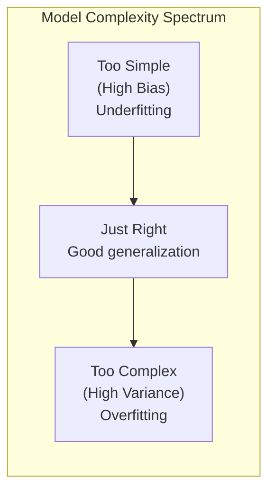

Practically: **underfitting** shows up as poor performance on *both* training and test data (the model never learned the pattern in the first place); **overfitting** shows up as excellent training performance but much worse test performance (the model memorized training-specific noise instead of the general pattern). The goal of model selection, regularization, and hyperparameter tuning (e.g., choosing $C$ in SVM, tree depth, network size, or L1/L2 regularization strength) is to find the sweet spot that minimizes *total* error on unseen data — this is typically diagnosed via a validation set or cross-validation, by comparing training vs. validation error curves as model complexity increases.

**Common remedies**:
- *For underfitting*: use a more expressive model, add features, reduce regularization, train longer.
- *For overfitting*: get more training data, use regularization (L1/L2, dropout in neural nets), reduce model complexity, use early stopping, use ensembling, use data augmentation.

### 12.2 Performance Measurement

For a **binary classifier**, predictions vs. actual outcomes are summarised in a **confusion matrix**:

| | Predicted Positive | Predicted Negative |
|---|---|---|
| **Actual Positive** | True Positive (TP) | False Negative (FN) |
| **Actual Negative** | False Positive (FP) | True Negative (TN) |

From this, several metrics are derived:

- **Accuracy** $= \dfrac{TP+TN}{TP+TN+FP+FN}$ — overall fraction correct; **misleading on imbalanced datasets** (e.g., 99% accuracy is trivial if 99% of data is one class).
- **Precision** $= \dfrac{TP}{TP+FP}$ — "of everything I labelled positive, how much was actually positive?" Matters most when false positives are costly (e.g., flagging a legitimate transaction as fraud).
- **Recall (Sensitivity / TPR)** $= \dfrac{TP}{TP+FN}$ — "of everything that was actually positive, how much did I catch?" Matters most when false negatives are costly (e.g., missing a cancer diagnosis).
- **F1 Score** $= 2\cdot\dfrac{\text{Precision}\times\text{Recall}}{\text{Precision}+\text{Recall}}$ — the harmonic mean of precision and recall, useful as a single number when both matter and there's a trade-off between them (raising the classification threshold typically raises precision but lowers recall, and vice versa).
- **ROC curve / AUC**: plots True-Positive-Rate vs. False-Positive-Rate across all classification thresholds; the Area Under the Curve (AUC) summarises overall discriminative ability independent of any single threshold choice (AUC = 0.5 is random guessing, 1.0 is perfect separation).

**For regression models**, common metrics instead include Mean Squared Error (MSE), Root MSE (RMSE), Mean Absolute Error (MAE), and $R^2$ (coefficient of determination, the proportion of variance in the target explained by the model).

**Best practice**: always measure performance on data the model did **not** train on (a held-out **test set**, or better, **k-fold cross-validation**, where the data is split into $k$ parts, the model is trained on $k{-}1$ folds and tested on the remaining fold, repeated $k$ times and averaged) — measuring performance on training data alone will always look artificially good and hides overfitting.

---

## Further Reading / References

- Russell, S. & Norvig, P., *Artificial Intelligence: A Modern Approach* — the standard reference for the state-space search material in Part I (problem formulation, BFS/DFS/IDS, A*, admissible/consistent heuristics).
- Wikipedia — [A* search algorithm](https://en.wikipedia.org/wiki/A*_search_algorithm), [Consistent heuristic](https://en.wikipedia.org/wiki/Consistent_heuristic), [Bias–variance tradeoff](https://en.wikipedia.org/wiki/Bias%E2%80%93variance_tradeoff), [Gating mechanism (LSTM/GRU)](https://en.wikipedia.org/wiki/Gating_mechanism) — used to verify formal definitions, proofs, and gate equations.
- GeeksforGeeks — [Gated Recurrent Unit Networks](https://www.geeksforgeeks.org) — GRU gate equations.
- KDnuggets — *A Friendly Introduction to Support Vector Machines* — margin/hyperplane intuition.
- Cho et al. (2014), original GRU paper; Hochreiter & Schmidhuber (1997), original LSTM paper — for readers who want the primary sources on gated RNNs.

*Note: diagrams above are drawn as Mermaid diagrams so they render directly inside this Markdown file in any Mermaid-capable viewer (GitHub, VS Code with a Mermaid extension, Obsidian, Claude's own artifact viewer, etc.). If your viewer doesn't render Mermaid, the diagrams still read fine as structured text/pseudocode.*
